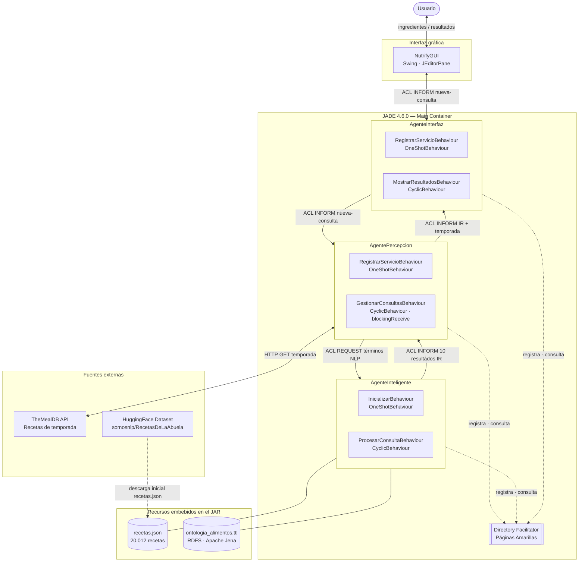
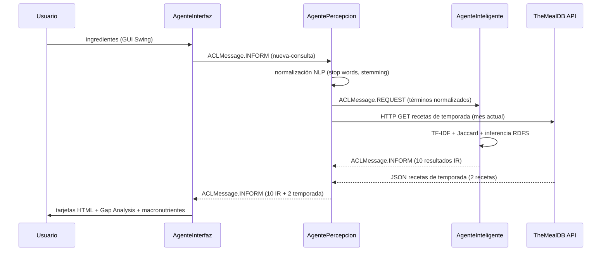

# Nutrify: Nutricionista Virtual

Sistema multiagente JADE que recomienda recetas a partir de los ingredientes disponibles.  
Desarrollado para la asignatura **Sistemas Inteligentes**, UPM, curso 2025-26.

**Autores:** José Ángel Galán Blázquez JAGB709
              Rodrigo López de Lacalle Estívariz Rodrigo-LdL  
**Repositorio:** https://github.com/JAGB709/Nutrify

---

## 1. Descripción

Nutrify aplica técnicas de **Recuperación de Información** (TF-IDF + Similitud Coseno + Jaccard) sobre un corpus de 20 000 recetas reales del dataset [RecetasDeLaAbuela](https://huggingface.co/datasets/somosnlp/RecetasDeLaAbuela). Los ingredientes de la consulta se normalizan con un pipeline NLP (minúsculas, eliminación de acentos, stop words en español, stemming) y se buscan en un índice invertido construido en tiempo de arranque.

Además de los 10 resultados del motor IR, `AgentePercepcion` consulta la **API pública de TheMealDB** para obtener 2 recetas de temporada del mes actual una fuente dinámica que cambia mensualmente.

La ontología RDF de alimentos (Apache Jena con razonador RDFS) clasifica los ingredientes por categoría (*Pescado*, *Carne*, *Legumbre*, *Vegetal*…) y permite inferir tipos transitivos: `salmon → Pescado → Proteína → Alimento`.

---

## 2. Arquitectura del sistema

### Diagrama de componentes



### Tabla de agentes y comportamientos

| Agente | Behaviours | Rol |
|--------|-----------|-----|
| `AgentePercepcion` | `OneShotBehaviour` + `CyclicBehaviour` | Pipeline NLP, consulta IR al AgenteInteligente, percepción web (TheMealDB) |
| `AgenteInteligente` | `OneShotBehaviour` + `CyclicBehaviour` | Motor TF-IDF, índice invertido, inferencia RDFS con Apache Jena |
| `AgenteInterfaz` | `OneShotBehaviour` + `CyclicBehaviour` | GUI Swing HTML, Gap Analysis de ingredientes, tarjetas de temporada |

### Flujo de mensajes ACL



---

## 3. Instalación

### Requisitos previos

- **Java** 11 o superior (probado con OpenJDK 11, 17 y 25)
- **Maven** 3.6+ o **IntelliJ IDEA** con Maven integrado
- JADE 4.6.0 incluido en `lib/jade.jar` (no requiere descarga adicional)

#### Instalar Java

```bash
# Ubuntu / Debian / Parrot OS
sudo apt update && sudo apt install openjdk-11-jdk

# Fedora / RHEL / CentOS
sudo dnf install java-11-openjdk-devel

# macOS con Homebrew
brew install openjdk@11
echo 'export PATH="/opt/homebrew/opt/openjdk@11/bin:$PATH"' >> ~/.zshrc

# Windows (winget)
winget install EclipseAdoptium.Temurin.11.JDK

# Verificar
java -version
```

#### Instalar Maven (opcional — solo si no usas IntelliJ)

```bash
# Ubuntu / Debian
sudo apt install maven

# macOS con Homebrew
brew install maven

# Windows (winget)
winget install Apache.Maven

# Verificar
mvn --version
```

> **IntelliJ IDEA**: trae Maven integrado. No necesitas instalarlo por separado; basta con abrir el proyecto y pulsar *Load Maven Project* o *Reload All Maven Projects* en el panel de Maven.

### Clonar el repositorio

```bash
git clone https://github.com/JAGB709/Nutrify.git
cd Nutrify
```

Abrir el directorio `Nutrify/` como proyecto Maven en IntelliJ IDEA.  
IntelliJ descargará automáticamente **Apache Jena 4.10.0** y **JUnit 5** desde Maven Central.

### Dependencias detalladas

Todas las dependencias están declaradas en `pom.xml`. Maven las descarga automáticamente al compilar.

| Dependencia | Versión | Origen | Uso |
|-------------|---------|--------|-----|
| **JADE** | 4.6.0 | `lib/jade.jar` (incluido en el repo; instalado en el repositorio Maven local con `mvn install:install-file`) | Framework multi-agente: contenedor, Directory Facilitator, ACL messaging |
| **Apache Jena** (`apache-jena-libs`) | 4.10.0 | Maven Central | Motor RDFS: carga de ontología TTL, razonador inferencial, consultas SPARQL |
| **JUnit Jupiter** | 5.10.2 | Maven Central | Tests unitarios (solo compilación de tests; no se empaqueta en el JAR final) |
| **Java** | 11+ | Sistema operativo | Plataforma de ejecución |

#### Instalación local de JADE en Maven

JADE no está en Maven Central. El `pom.xml` lo referencia como dependencia local. Si Maven no lo encuentra, ejecutar una vez:

```bash
# Desde el directorio raíz del proyecto (donde está pom.xml)
mvn install:install-file \
    -Dfile=lib/jade.jar \
    -DgroupId=com.tilab.jade \
    -DartifactId=jade \
    -Dversion=4.6.0 \
    -Dpackaging=jar
```

Después de este comando, `mvn package` funciona sin errores.

#### Árbol de dependencias transitivas relevantes

Apache Jena 4.10.0 trae las siguientes dependencias transitivas (descargadas automáticamente por Maven):

| Librería transitiva | Versión | Propósito |
|--------------------|---------|-----------|
| SLF4J API | 2.0.x | Fachada de logging |
| Log4j 2 | 2.x | Implementación de logging |
| Jackson Databind | 2.x | Serialización JSON interna de Jena |
| Apache Commons Lang | 3.x | Utilidades de cadenas y arrays |
| Protobuf Java | 3.x | Formato RDF binario (Thrift/Protobuf) |

Ninguna de estas librerías requiere configuración adicional; Maven las gestiona de forma automática.

---

## 4. Ejecución

### Opción A: Ejecutable standalone (recomendado)

Sin necesidad de Maven ni IntelliJ. Solo requiere Java 11+:

```bash
# Linux / macOS
chmod +x nutrify.sh
./nutrify.sh                        # modo interactivo (GUI)
./nutrify.sh tomate cebolla ajo     # consulta directa

# Windows
nutrify.bat
nutrify.bat tomate cebolla ajo
```

### Opción B: Desde IntelliJ IDEA

1. Esperar a que Maven sincronice las dependencias.
2. Abrir `src/main/java/es/upm/agentlauncher/Main.java`.
3. Pulsar **Run** (▶).
4. Se abre **NutrifyGUI**: escribir ingredientes separados por coma y pulsar *Buscar Recetas*.

### Opción C: Línea de comandos con Maven

```bash
# Compilar
mvn compile

# Ejecutar (modo interactivo con GUI)
mvn exec:java -Dexec.mainClass="es.upm.agentlauncher.Main"

# Ejecutar con ingredientes predefinidos
mvn exec:java -Dexec.mainClass="es.upm.agentlauncher.Main" \
              -Dexec.args="tomate huevo cebolla"
```

---

## 5. Datos de ejemplo

Al arrancar el sistema se abre la ventana **NutrifyGUI**. Introducir los ingredientes separados por coma en el campo de búsqueda y pulsar *Buscar Recetas*.

| Consulta de ejemplo | Tipo de recetas esperadas |
|---------------------|--------------------------|
| `tomate, cebolla, ajo` | Salsas, sofritos, guisos mediterráneos |
| `pollo, arroz, pimiento` | Arroces con pollo, paellas |
| `huevo, patata, cebolla` | Tortilla española y variantes |
| `salmon, limon, ajo` | Salmón a la plancha, ceviches |
| `garbanzo, cebolla, tomate` | Cocidos, potajes, guisos de legumbre |

El sistema muestra para cada resultado: **puntuación de relevancia**, **macronutrientes** (calorías, proteínas, grasa, carbohidratos), **pasos de preparación** e ingredientes que **te faltarían** (Gap Analysis).

Además de los resultados del motor IR, aparecen 2 **recetas de temporada** obtenidas en tiempo real de TheMealDB según el mes actual.

---

## 6. Tests

```bash
mvn test
```

Dos suites JUnit 5 que verifican el motor IR y la ontología:

| Suite | Tests | Qué verifica |
|-------|-------|-------------|
| `OntologiaTest` | 7 | Carga TTL, jerarquía RDFS, inferencia transitiva (`salmon → Pescado → Proteína`) |
| `RecuperacionInformacionTest` | 10+ | Pipeline NLP, fórmulas TF-IDF, índice invertido, ranking por coseno + Jaccard |

---

## 7. Dataset y ontología

- **Corpus de recetas**: [somosnlp/RecetasDeLaAbuela](https://huggingface.co/datasets/somosnlp/RecetasDeLaAbuela)  20 012 recetas en español. El fichero `recetas.json` está embebido en el JAR. Para regenerarlo, ejecutar `scripts/download_dataset.py`.
- **Recetas de temporada**: [TheMealDB](https://www.themealdb.com/) API pública sin autenticación. `AgentePercepcion` consulta `filter.php?i={ingrediente}` y `lookup.php?i={id}` según el mes actual (enero–diciembre).
- **Ontología de alimentos**: `src/main/resources/ontologia_alimentos.ttl` jerarquía RDFS de categorías de alimentos con valores nutricionales por 100 g. El razonador RDFS de Apache Jena infiere supertipos transitivos en tiempo de ejecución.

---

## 8. Declaración de uso de IA

Se ha utilizado IA generativa (Claude Sonnet) como asistente de codificación durante el desarrollo. Concretamente se usó para:

- Generación de la estructura inicial de los agentes JADE y la configuración Maven.
- Elaboración del script de descarga y limpieza del dataset (`download_dataset.py`).
- Revisión de la lógica del motor IR (normalización L2 para similitud coseno correcta).
- Generación de casos de prueba JUnit 5 a partir de las especificaciones de los autores.
- Redacción de los comentarios y Javadoc del código fuente.
- Asistencia en la redacción de este README.

Todo el código generado ha sido revisado, comprendido, adaptado y validado por los autores del proyecto.
