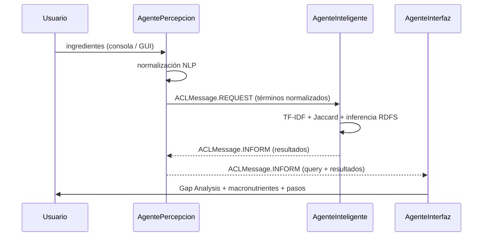

# Nutrify — Nutricionista Virtual

Sistema multiagente JADE que recomienda recetas a partir de los ingredientes disponibles.  
Desarrollado para la asignatura **Sistemas Inteligentes** — UPM, curso 2025-26.

**Autores:** JAGB709 · Rodrigo-LdL  
**Repositorio:** https://github.com/JAGB709/Nutrify

---

## Descripción

Nutrify aplica técnicas de **Recuperación de Información** (TF-IDF + Similitud Coseno + Jaccard) sobre un corpus de 20 000 recetas reales del dataset [RecetasDeLaAbuela](https://huggingface.co/datasets/somosnlp/RecetasDeLaAbuela). Los ingredientes de la consulta se normalizan con un pipeline NLP (minúsculas, eliminación de acentos, stop words en español, stemming) y se buscan en un índice invertido construido en tiempo de arranque.

La ontología RDF de alimentos (Apache Jena con razonador RDFS) clasifica los ingredientes por categoría (*Pescado*, *Carne*, *Legumbre*, *Vegetal*…) y permite inferir tipos transitivos: `salmon → Pescado → Proteína → Alimento`.

---

## Arquitectura

Tres agentes JADE se comunican mediante mensajes ACL a través del Directory Facilitator (DF):



| Agente | Behaviour | Rol |
|--------|-----------|-----|
| `AgentePercepcion` | `CyclicBehaviour` | Entrada del usuario, NLP, despacho |
| `AgenteInteligente` | `CyclicBehaviour` + `blockingReceive` | Motor IR, ontología RDFS |
| `AgenteInterfaz` | `CyclicBehaviour` | Presentación, Gap Analysis, GUI Swing |

---

## Requisitos

- **Java** 11 o superior (probado con OpenJDK 25)
- **IntelliJ IDEA** con Maven integrado
- `lib/jade.jar` incluido en el repositorio (JADE 4.6.0)

---

## Instalación

```bash
git clone https://github.com/JAGB709/Nutrify.git
cd Nutrify
```

Abrir el directorio `Nutrify/` como proyecto Maven en IntelliJ IDEA.  
IntelliJ descargará automáticamente Apache Jena 4.10.0 y JUnit 5.

---

## Ejecución

### Desde IntelliJ IDEA

1. Esperar a que Maven sincronice las dependencias.
2. Abrir `src/main/java/es/upm/agentlauncher/Main.java`.
3. Pulsar **Run** (▶).
4. Se abre **NutrifyGUI**: escribir ingredientes separados por coma y pulsar *Buscar Recetas*.

### Desde línea de comandos

```bash
# Compilar
mvn compile

# Ejecutar (modo interactivo con GUI)
mvn exec:java -Dexec.mainClass="es.upm.agentlauncher.Main"

# Ejecutar con ingredientes predefinidos
mvn exec:java -Dexec.mainClass="es.upm.agentlauncher.Main" \
              -Dexec.args="tomate huevo cebolla"
```

---

## Datos de ejemplo

| Consulta | Recetas esperadas |
|----------|-------------------|
| `tomate, cebolla, ajo` | salsas, sofritos, guisos |
| `pollo, arroz, pimiento` | arroces con pollo, paellas |
| `huevo, patata, cebolla` | tortilla española y variantes |
| `salmon, limon, ajo` | salmón a la plancha, ceviches |
| `garbanzo, cebolla, tomate` | cocidos, potajes |

---

## Tests

```bash
mvn test
```

Dos suites JUnit 5:
- **OntologiaTest** — carga TTL, jerarquía RDFS e inferencia transitiva.
- **RecuperacionInformacionTest** — NLP, TF-IDF, índice invertido y ranking.

---

## Dataset y ontología

- **Corpus**: [somosnlp/RecetasDeLaAbuela](https://huggingface.co/datasets/somosnlp/RecetasDeLaAbuela) — 20 012 recetas en español. El script `scripts/download_dataset.py` permite regenerar `recetas.json`.
- **Ontología**: `src/main/resources/ontologia_alimentos.ttl` — jerarquía RDFS de categorías de alimentos con valores nutricionales por 100 g.

---

## Declaración de uso de IA

Se ha utilizado IA generativa (Claude) como asistente de codificación para:
- Generación del esqueleto de los agentes JADE, la configuración Maven y los comentarios del codigo.
- Elaboración del script de descarga y limpieza del dataset. (pendiente de actualizar ya que se integrara esta tarea en el agente de percepcion)
- Revisión de la lógica del motor IR (normas de documento para similitud coseno correcta).
- Generación de tests dadas unas características y casos específicos
- Asistencia en la redacción de este readme

Todo el código generado ha sido revisado, adaptado y validado por los autores del proyecto.
